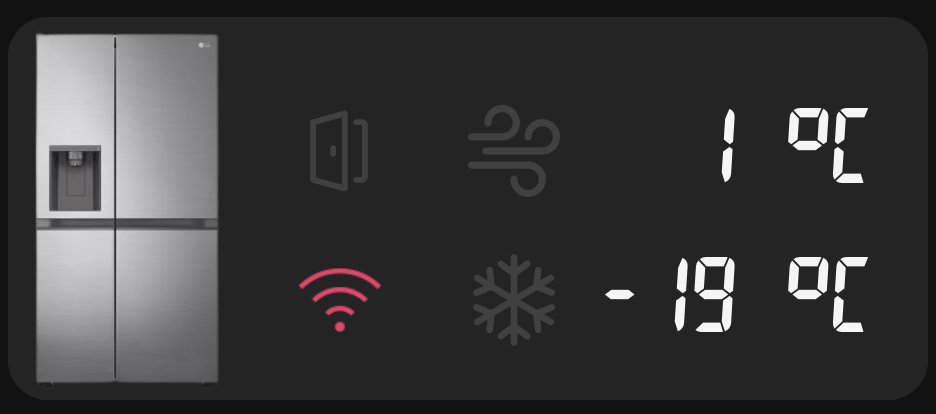

This repo is for Home Assistant users who want cards that look like their LG ThinQ enabled machines physical displays. You'll need the LG ThinQ integration already installed.

This repo currently contains cards for LG Washers and Dryers.

Known supported/tested models:
Washer/Dryer: This card is expected to apply pretty widely to any/all LG ThinQ washers and dryers. The implementation from the ThinQ integration is quite standardised.

# Installation

1. Ensure you have HACS (Home Assistant Community Store) installed.
2. In HACS, go to "Frontend" and click the three dots in the top right to add a "Custom repository".
3. Use the URL of this GitHub repository and select "Lovelace" as the category.
4. Click "Add", then find the "LG ThinQ Cards" entry and click "Install".
5. HACS will ask you to add the resource to your Lovelace configuration. Click "Add to Lovelace".

# Configuration
1. Go to your desired Lovelace dashboard and click "Add Card".
2. Search for "LG Washer Card" or "LG Dryer Card" and select it.
3. Use the visual editor to select the entities from your LG ThinQ integration.
    - **Entity**: The main sensor for your machine (e.g., `sensor.washer`). `remain_time`, `current_course`, `water_temp`, and `spin_speed` are all read as *attributes* of this one entity - most integrations (including [ha-smartthinq-sensors](https://github.com/ollo69/ha-smartthinq-sensors)) already expose them that way, so there's nothing else to configure for those.
    - **Run State Entity**: The sensor that shows the current state (e.g., `sensor.washer_run_state`).
    - **Door Lock Entity** (optional, washer only): Only needed if your integration exposes door lock as its *own* entity. Otherwise the card reads the `door_lock` attribute off `entity` automatically, same as the fields above - override the attribute name with `door_lock_attribute` if yours is called something else.
4. Click "Save".

There is no longer any need to modify `configuration.yaml` or manually add resources.

Minimal working example (matches `sensor.washer` / `sensor.washer_run_state` from ha-smartthinq-sensors - no door lock config needed):
```yaml
type: custom:lg-washer-card
entity: sensor.washer
run_state_entity: sensor.washer_run_state
```

With a separate door-lock entity instead (only if your integration provides one):
```yaml
type: custom:lg-washer-card
entity: sensor.washer
run_state_entity: sensor.washer_run_state
door_lock_entity: binary_sensor.washer_door_lock
```


# Development

If you are contributing to this project or working on it across multiple machines, please run the setup script to install the necessary Git hooks:

```bash
chmod +x scripts/install-hooks.sh
./scripts/install-hooks.sh
```

This will ensure that the `dist` folder is automatically kept in sync with the `src` folder before every commit.

---
*This integration was converted to be HACS-compatible with assistance from a Google AI.*
